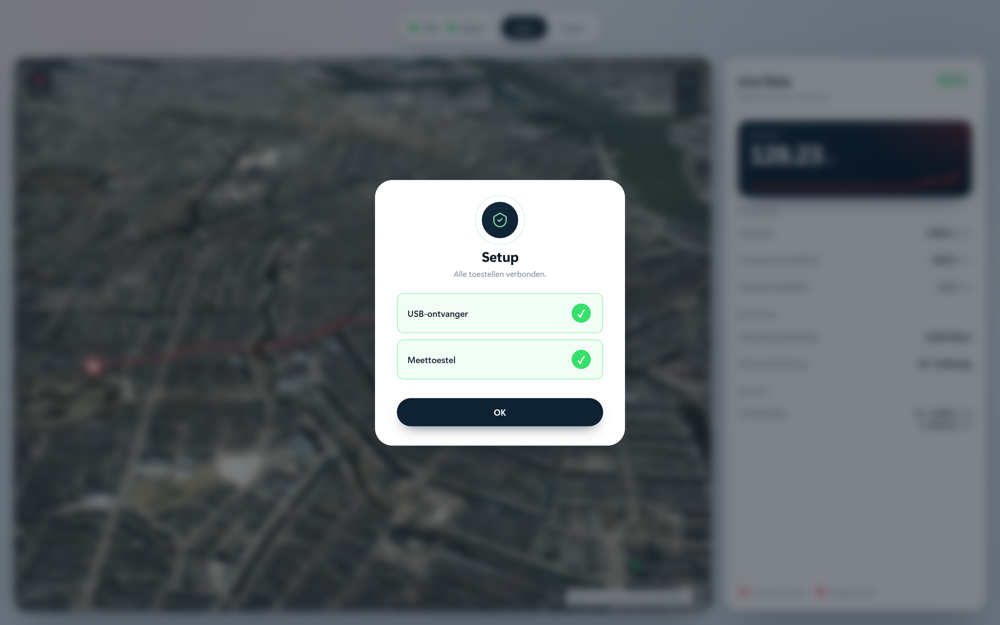
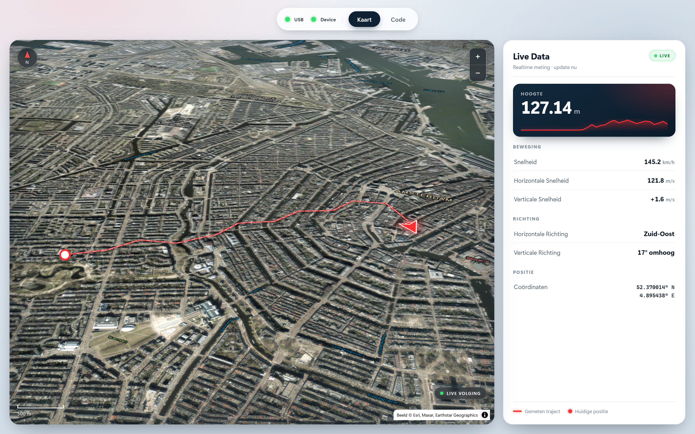
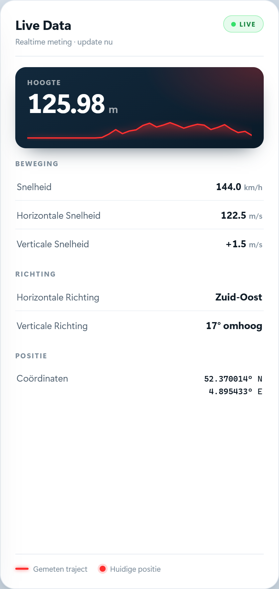
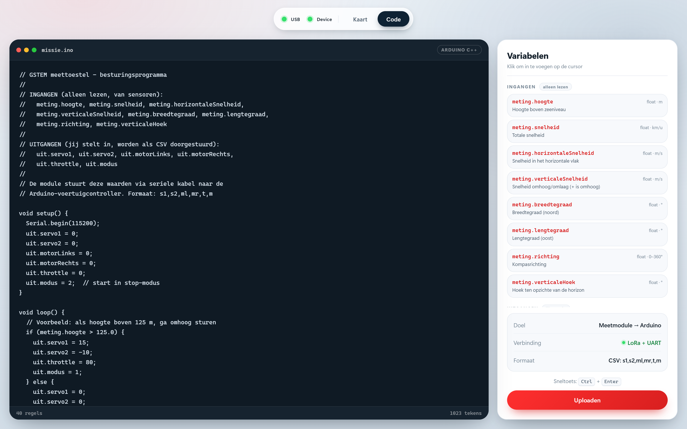
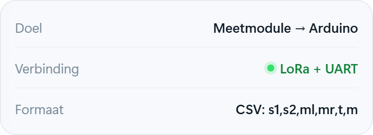
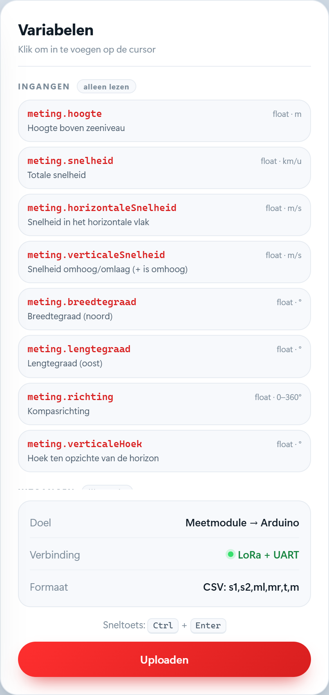
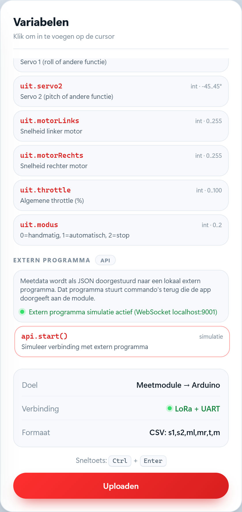

# Handleiding voor ***Positie- en beweging meetmodule met LoRa integratie***

*Versie: concept.*

> [!tip] Zo lees je deze handleiding
> Je hebt geen technische kennis nodig.
> Volg de hoofdstukken in volgorde.
> Bij **SCREENSHOT** voeg je zelf een foto in. De schermafbeeldingen van de app zijn al ingevoegd.
> Bij **AI-AFBEELDING** kan je een afbeelding laten maken om iets duidelijker te tonen.

## 1. Wat doet het toestel?

Het meettoestel meet waar en hoe het beweegt.

Het stuurt de gegevens draadloos naar je laptop.

Op de laptop zie je alles live: op een kaart en in een tabel.

Het toestel meet:

- hoogte
- positie (breedtegraad en lengtegraad)
- snelheid (totaal, horizontaal en verticaal)
- richting (kompas)
- verticale hoek (hoe schuin het toestel staat)

> [!screenshot] SCREENSHOT 1 — Overzicht van het toestel
> Maak een duidelijke foto van het volledige toestel.
> Zet er een kort fotobijschrift onder: "Het meettoestel".

## 2. Toestel aanzetten en verbinden

### 2.1 Toestel aanzetten

Zet eerst het toestel aan waarop het meettoestel is aangesloten.

Het meettoestel krijgt dan stroom en begint meteen te meten.

> [!screenshot] SCREENSHOT 2 — Toestel aanzetten
> Maak een foto van de schakelaar of knop die je indrukt.
> Duid met een pijl of cirkel aan wat je moet indrukken.

### 2.2 USB-ontvanger insteken

Steek de USB-ontvanger in je laptop.

Het programma start vanzelf. Je moet niets extra openen.

> [!screenshot] SCREENSHOT 3 — USB-ontvanger insteken
> Maak een foto waarop te zien is hoe de USB-ontvanger in de laptop wordt gestoken.

### 2.3 Het eerste scherm

Je ziet twee vakjes:

- USB-ontvanger
- Meettoestel

Wacht tot **beide** vakjes aangevinkt zijn.

Dan wordt de knop **OK** actief. Klik op OK.

> [!screenshot] SCREENSHOT 4 — Eerste scherm
> Maak een schermafbeelding van het eerste scherm.
> Zorg dat de twee vakjes en de knop OK duidelijk zichtbaar zijn.

## 3. Tweede scherm: kaart en live data

Alle gegevens worden live getoond, op twee manieren.

### 3.1 De 3D-kaart

Links zie je een 3D-kaart met satellietfoto's.

Daarop zie je:

- de afgelegde route
- de richting waarin het toestel kijkt (de pijl)

> [!screenshot] SCREENSHOT 5 — Het kaartscherm
> Maak een schermafbeelding van het volledige tweede scherm.
> Links de kaart met route en pijl, rechts de live data.

### 3.2 De cijfertabel

Rechts zie je alle meetwaarden in cijfers.

De grote cijfers zijn de belangrijkste waarden. De kleine vakjes geven de details.

> [!screenshot] SCREENSHOT 6 — De meetwaarden
> Maak een ingezoomde schermafbeelding van het rechterpaneel met de cijfers.

## 4. Codescherm: zelf de besturing bepalen

Er is nog een tabblad: **Code**.

Daar schrijf je zelf een programma. Dat programma bepaalt wat er met de metingen gebeurt.

In het scherm zie je:

- links: de editor waar je je code typt
- rechts: variabelen die je met één klik invoegt
- onderaan: de knop **Uploaden**

De variabelen zijn:

- **Ingangen** (alleen lezen): hoogte, snelheid, richting, positie
- **Uitgangen** (jij stelt ze in): servo's, motoren, throttle

Je kiest zelf de regel.

Bijvoorbeeld: "als de hoogte groter is dan X, stuur servo 1 naar Y".

Je hoeft de techniek erachter niet te kennen. Klik op een variabele en vul zelf de waarden in.

> [!screenshot] SCREENSHOT 7 — Het codescherm
> Maak een schermafbeelding van het codescherm met links de editor en rechts de variabelen.

> [!screenshot] AI-AFBEELDING 1 — Werking van de code
> Laat een AI-afbeelding maken van een blokschema:
> "Meting komt binnen -> jouw programma beslist -> stuurwaarde gaat naar het toestel".

## 5. Meer in detail

### 5.1 Wat doet de knop Uploaden?

Met de knop **Uploaden** zet je jouw programma op het toestel.

Je typt je code links in de editor. Zolang je niet uploadt, gebeurt er niets: de code blijft op je laptop staan.

Zodra je op **Uploaden** klikt, stuurt de app de code draadloos naar het toestel. Het toestel vervangt de vorige code en begint meteen met de nieuwe te werken.

Lukt het uploaden niet, controleer dan de verbinding en klik opnieuw. Je verliest je code niet; die blijft in de editor staan.

### 5.2 Variabelen aanklikken

Rechts in het codescherm staat een lijst met **variabelen**. Elke variabele is een kort voorbeeld van iets wat je kan gebruiken.

Je hoeft de namen niet uit je hoofd te kennen. Klik op een variabele en hij verschijnt in de editor. Daarna vul je zelf de waarde in.

Er zijn twee soorten:

- **Ingangen** — waarden die het toestel meet, zoals hoogte, snelheid, richting en positie. Die kan je alleen lezen, niet veranderen.
- **Uitgangen** — waarden die jij instelt, zoals servo's, motoren en throttle. Die stuur je naar het toestel.

Zo bouw je stap voor stap een regel, bijvoorbeeld: **als** de hoogte groter is dan X, **stuur** servo 1 naar Y.

### 5.3 Wat de app zelf doet

De app is het middelpunt tussen jou en het toestel:

- ze toont de metingen **live** op de kaart en in de cijfertabel;
- ze laat je code schrijven en **uploaden**;
- ze stuurt de **stuurwaarden** terug naar het toestel.

### 5.4 De API: je eigen programma buiten de app

Naast het codescherm heeft de app een **API**. Dat is een vaste verbinding waarmee een programma op je eigen computer met de app kan praten.

Je gebruikt de API als je iets wil doen wat het codescherm niet kan, bijvoorbeeld in een eigen programma in **Python**.

De gegevens gaan heen en weer:

1. De app stuurt de **meetgegevens** naar jouw programma.
2. Jouw programma verwerkt die gegevens.
3. Je stuurt een **stuurwaarde** terug naar de API.
4. De app stuurt die waarde verder naar het toestel.

De gegevens zijn opgemaakt in **JSON**, zodat elk programma ze makkelijk kan lezen. De precieze techniek (WebSocket, TCP, HTTP of named pipe) wordt nog gekozen.

> [!tip] Je hoeft de API niet te gebruiken. Het codescherm in de app is genoeg voor de meeste toepassingen.

## 6. Gegevens doorgeven aan een eigen programma

Je kan de metingen ook naar een eigen programma sturen.

Dat programma maak je zelf. Het draait op dezelfde computer.

Het ontvangt de metingen terwijl ze binnenkomen.

Je kiest zelf wat het programma doet. Het kan ook iets terugsturen naar het toestel.

> [!screenshot] AI-AFBEELDING 2 — Gegevens doorgeven
> Laat een AI-afbeelding maken van: app -> pijl "meetgegevens" -> eigen programma ->
> pijl terug "stuurwaarde".

## 7. Koppelen aan de controller van een voertuig

Het meettoestel kan ook een voertuig besturen.

De ketting is:

metingen -> toestel -> laptop -> stuurwaarden -> toestel -> controller -> motoren en servo's

Zo werkt het:

- Je schrijft zelf een programma.
- Of je gebruikt een voorbereid voorbeeldprogramma.
- Dat programma bepaalt hoe het voertuig reageert.
- Het meettoestel geeft de stuurwaarden door aan de controller.

Je hoeft de bedrading of de techniek niet te kennen. Je werkt met de variabelen uit de app.

> [!screenshot] AI-AFBEELDING 3 — Connecties tussen de bordjes
> Laat een AI-afbeelding maken van: laptop — USB-ontvanger — (draadloos) — meetmodule —
> draden — controller — motoren/servo's.
> Label elke stap kort. Dit kan een echte foto vervangen zolang de opstelling nog niet gebouwd is.

> [!screenshot] SCREENSHOT 8 — Aansluiting op de controller
> Zodra de opstelling klaar is: maak een echte foto van de draden tussen het meettoestel en de
> controller.

## 8. Veiligheid

- Test eerst met de motoren uit.
- Zorg voor een veiligheidsstop.
- Bij twijfel: motoren naar nul, servo's neutraal.
- Laat het toestel nooit zonder toezicht werken.
- Controleer de batterij en de antennes voor elke test.

> [!screenshot] SCREENSHOT 9 — Testopstelling
> Maak een foto van de testopstelling met de veiligheidsmaatregelen, bijvoorbeeld de motoren
> losgekoppeld of een noodschakelaar.

## 9. Gegevens bewaren

De route en de metingen worden bewaard. Je kan ze later opnieuw bekijken.

> [!question] Werkpunt (nog niet gebouwd) — route en metingen als bestand
> Later kan je de route en de metingen opslaan als een bestand.
> Dat bestand kan je dan direct openen in de website.
> Dit wordt later uitgewerkt. Nu staat het enkel als werkpunt genoteerd.

> [!screenshot] SCREENSHOT 10 — Opgeslagen gegevens
> Maak een schermafbeelding van de plek waar je een eerdere meting of route terugvindt.

## 10. Startchecklist

- [ ] Toestel aanzetten
- [ ] USB-ontvanger insteken
- [ ] Wachten tot beide vakjes aangevinkt zijn
- [ ] Op OK klikken
- [ ] Controleren of de kaart en de cijfers bewegen
- [ ] Eventueel eigen programma openen (tabblad Code)

## 11. Problemen oplossen

| Probleem | Wat doe je? |
| --- | --- |
| Geen USB-ontvanger in het eerste scherm | Steek de ontvanger opnieuw in en wacht enkele seconden |
| Het meettoestel geeft geen verbinding | Zet het toestel aan en controleer de batterij en de antenne |
| De kaart laadt niet | Controleer de internetverbinding van de laptop |
| De code wordt niet geüpload | Controleer de verbinding en klik opnieuw op Uploaden |
| De cijfers veranderen niet | Controleer of het meettoestel echt aan het meten is |

## 12. Technische gegevens

- **Meettoestel**: microcontroller met radio, bewegingssensor, barometer en positiebepaling.
- **Ontvanger**: tweede module met radio, verbonden met de laptop via USB.
- **Bereik**: via radio, dus geen lange kabel nodig.
- **Voeding**: oplaadbare batterij met spanningsregelaar.

> [!screenshot] SCREENSHOT 11 — Technische gegevens
> Maak eventueel een foto van het label of de printplaat van het toestel.

## 13. Woordenlijst

- **Meetmodule**: het toestel dat de metingen doet.
- **USB-ontvanger**: het toestelletje in de laptop dat de metingen doorgeeft.
- **Controller**: het bordje in het voertuig dat de motoren en servo's aanstuurt.
- **Servo**: een klein motortje dat een hoek instelt.
- **Throttle**: de algemene gasstand.
- **Veiligheidsstop**: de veilige toestand waarbij alles stopt.

## 14. Extra onderdelen die je nog kan toevoegen

- Een **titelblad** met projectnaam, logo en versie.
- Een **inhoudstafel** met paginanummers.
- Een **materiaallijst** per test.
- Een **onderhoudssectie**: batterij laden, behuizing en antennes controleren.
- Een **contact- of ondersteuningsblok**.
- Een **versiegeschiedenis** van de handleiding.

---

*Dit is een conceptversie. Vul de schermafbeeldingen in en pas de tekst aan waar nodig.*
