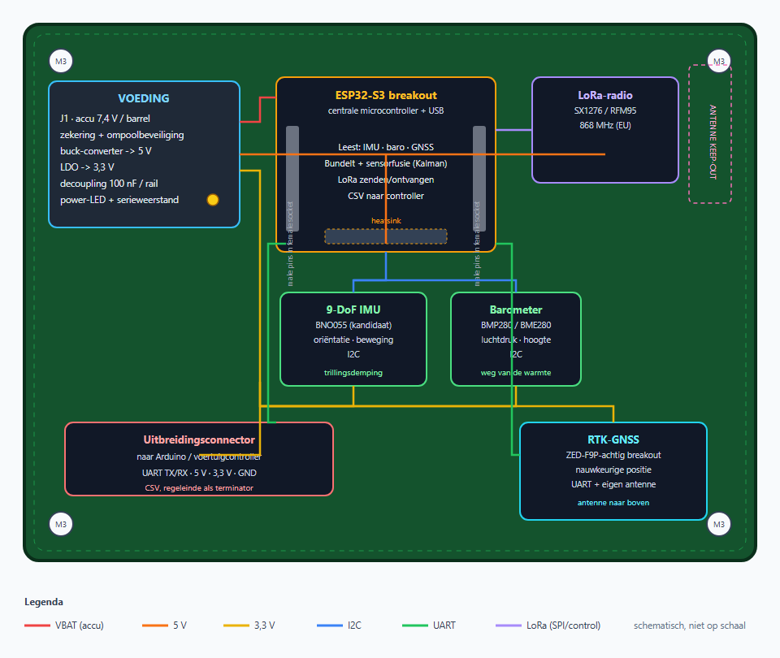
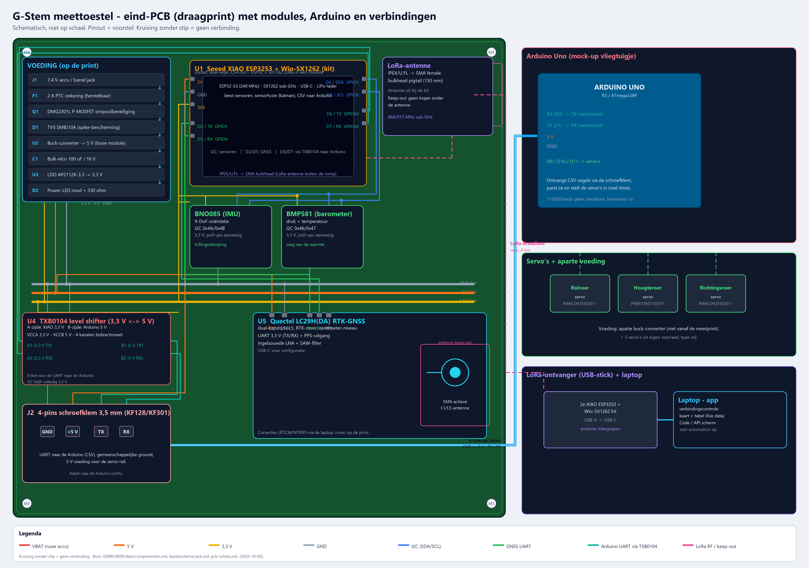
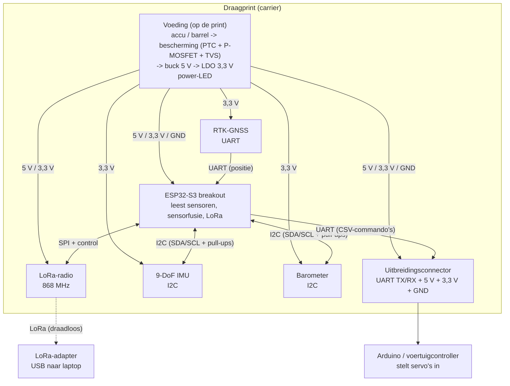
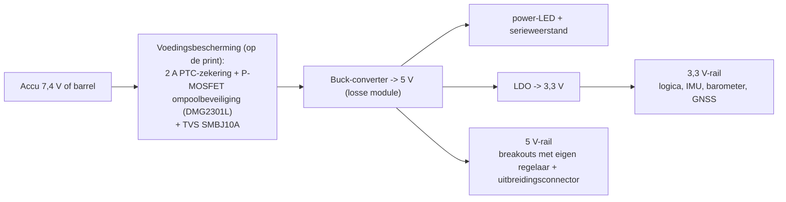

# PCB-schets — draagprint van het meettoestel

> [!info] Wat dit is
> Een **visuele schets** van hoe de zelfgemaakte draagprint eruitziet en hoe alles
> aangesloten is. Schematisch, niet op schaal. Bron: [[specificaties]] (`2026-10-06`),
> `documenten/specificaties/Ontwerp-meetmodule.md`.

## 1. Bovenaanzicht van de draagprint

> [!info] Eindbeeld met de Arduino (`2026-10-06`)
> Gedetailleerder beeld van de **eindtoestand**: de draagprint met de definitief gekozen
> breakouts, de losse componenten, de **Arduino Uno** en alle verbindingen.
>
> 

> [!tip] Bestanden
> `documenten/pcb/PCB-schets-draagprint.svg` (vector, scherp te vergroten), `documenten/pcb/PCB-schets-draagprint.png` (afbeelding) en dit markdown-bestand.

> [!note] Leeswijzer kleuren
> - **rood** = VBAT (ruwe accuspanning)
> - **oranje** = 5 V (na de buck-converter)
> - **geel** = 3,3 V (na de LDO)
> - **blauw** = I2C-bus (IMU + barometer)
> - **groen** = UART (GNSS + uitbreidingsconnector)
> - **paars** = LoRa-aansturing (SPI/control)
> - **stippellijn roze** = antenne-keep-out

## 2. Verbindingsschema (wie praat met wie)

## 3. Voedingsboom

## 4. Fysieke opbouw in het kort

| Zone | Wat | Waarom daar |
| --- | --- | --- |
| Linksboven | Voedingssectie **op de print**: 2 A PTC-zekering, P-MOSFET ompoolbeveiliging (DMG2301L), TVS SMBJ10A, LDO AP2112K-3.3, bulk-elco + power-LED | kort bij de connector, weg van de gevoelige sensoren |
| Midden | ESP32-S3 breakout op socket-headers | centraal knooppunt van alle sporen |
| Rechtsboven | LoRa-radio + antenne-keep-out | antenne vrij, ver van IMU/barometer |
| Midden-onder | IMU en barometer | bij elkaar op de I2C-bus, weg van warmte en antenne |
| Rechtsonder | RTK-GNSS + antenne | vrij zicht naar boven, keep-out rond de antenne |
| Linksonder | Uitbreidingsconnector | UART + voeding naar de Arduino/controller |
| Hoeken | 4× M3-bevestigingsgat | montage op afstandsbussen in de dempende behuizing |

## 5. Nog te bepalen

- Exacte afmetingen en laagopbouw van de print (voorlopig 2-laags).
- Welke breakout-modellen en dus welke pinouts/footprints.
- Of de uitbreidingsconnector volledig 3,3 V is, of dat er een level shifter nodig is.
- **Behuizing van de voedingsonderdelen:** SMD (AP2112K = SOT-23-5, DMG2301L = SOT-23, SMBJ10A = DO-214AA) of through-hole-equivalenten (AMS1117-3.3, P6KE10A, radiale PTC) — kiezen i.f.v. handmatig solderen.

Zie [[open-vragen]] en [[specificaties]].
