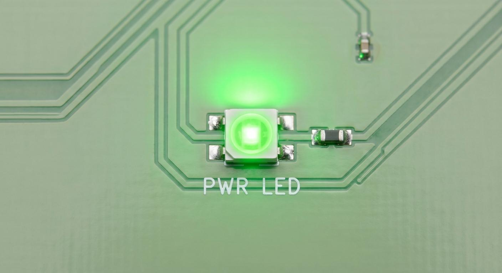
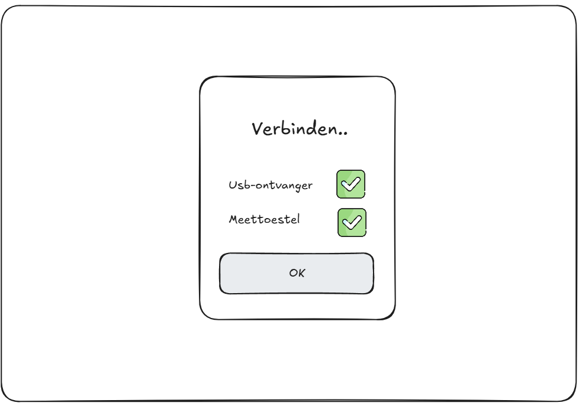
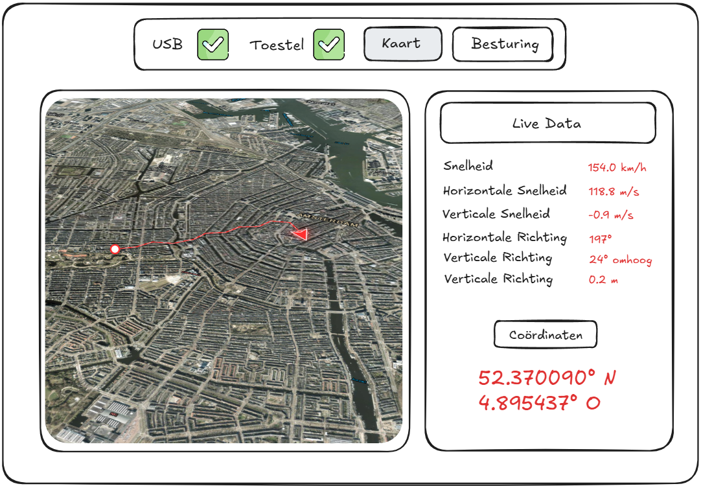
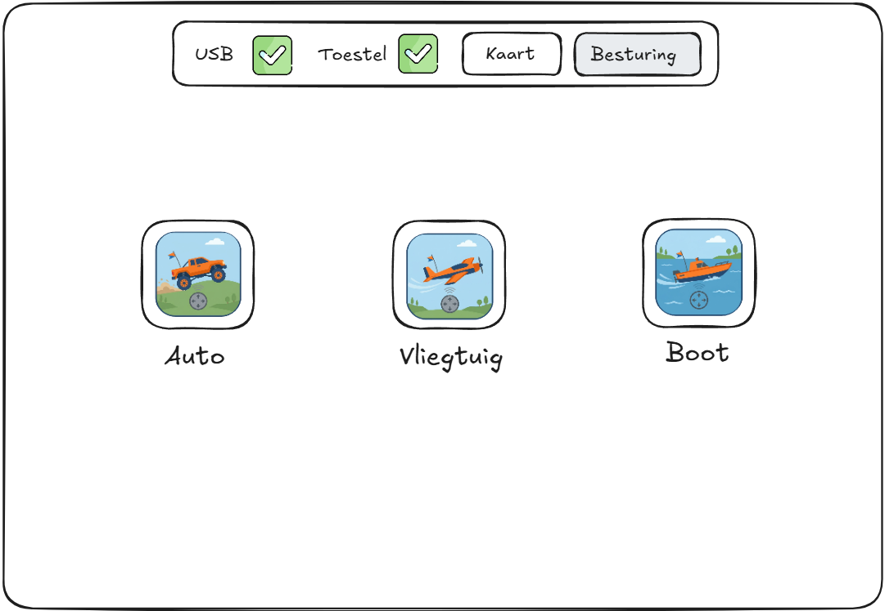
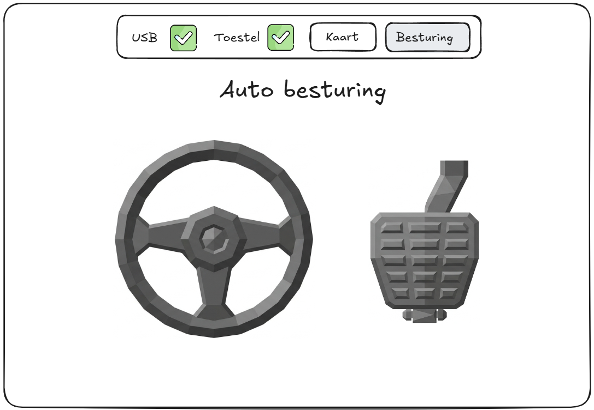

# **Specificaties voor Positie- en beweging meettoestel met LoRa integratie.**

# **Inleiding**

Dit is een klein meettoestel dat je op een voertuig of apparaat plaatst dat beweegt (zoals een vliegtuig, bootje of autootje). Het toestel meet tijdens het rijden of bewegen vier dingen:

> * **Richting:** Hoe schuin of recht het toestel staat (in graden op het horizontale en verticale vlak).
> * **Snelheid:** Hoe snel het beweegt (in kilometers per uur).
> * **Hoogte:** Hoe hoog het zich bevindt (nauwkeurig tot op 1,5 meter).
> * **Locatie:** Waar het precies is (nauwkeurig tot op 0,5 meter).

Bij het toestel hoort ook een kleine draadloze ontvanger die eruitziet als een USB-stick. Die steek je in je laptop. Het bereik tussen het toestel en deze ontvanger bedraagt maximaal 4 kilometer.

# **Aanzetten van toestel en laptop**

Zodra het voertuig of toestel waarop de module gemonteerd is wordt ingeschakeld, gaat het meettoestel automatisch aan. Een LED-lampje laat zien dat het toestel actief is.

Wanneer je de USB-ontvanger in je laptop steekt, start het bijbehorende programma vanzelf op.

# **Aplicatie**

## **Scherm 1**

Het programma controleert eerst de verbindingen vooraleer je verder kunt. Om door te gaan naar het volgende scherm klikt de gebruiker op **'OK'**.

## **Scherm 2**

In het scherm dat daarna verschijnt, wordt alle live data op twee duidelijke manieren getoond:

> 1. **Op een 3D-kaart met satellietfotografie van Google:** Hierop is te zien welke weg het toestel heeft afgelegd en in welke richting het op dit moment kijkt.
> 2. **In een tabel:** Waarin alle afzonderlijke meetgegevens overzichtelijk in cijferwaardes worden weergegeven.

Je ziet bovendien op elk scherm de actuele status van zowel de USB-ontvanger als het meettoestel.

## **Scherm 3**

Wanneer je op de knop **'Besturing'** klikt, kom je op een pagina met drie applicatie-iconen. Klik op een icoon om naar de bijbehorende pagina te gaan. Hier vind je de voertuigbedieningen die specifiek voor het type voertuig zijn gemaakt dat jij hebt.

## **Scherm 4**

Als je op de vorige pagina op het auto-icoon hebt geklikt, kom je op deze pagina terecht. Hier zie je een stuur en een gaspedaal. Door het gaspedaal ingedrukt te houden, rijdt het voertuig (in dit geval een autootje) naar voren. Het stuur bedien je door erop te klikken en te slepen; zo stuur je het fysieke voertuig. Elke besturings-app heeft zijn eigen unieke bedieningselementen.

# **Voertuig**

## **Uitleg**

Bij toevoeging van het meettoestel is er een voertuig dat aan de hand van het meettoestel wordt gecontroleerd. Dit hoeft geen volledig functioneel voertuig te zijn, en kan ook een demonstratiemodel zijn om te tonen hoe het apparaat gebruikt kan worden.

## **Installatie**

De gebruiker hoeft enkel de verbindingen te maken tussen de Arduino die het voertuig aanstuurt en het meettoestel: de aansluitingen voor data-overdracht en een gemeenschappelijke ground. Hiervoor heeft het meettoestel drie connectiepunten: **TX, RX en ground (GND)**.

### **Aanzetten**

Zodra het voertuig op de voeding wordt aangesloten, start het meettoestel automatisch mee op. Dit is te zien aan de voedings-LED. Steek de USB-ontvanger in en start de applicatie. Wanneer het voertuig wordt bewogen, zullen de live waarden accuraat meevolgen.

### **Besturing**

Via een van de besturing-applicaties kun je het voertuig aansturen met de meest geschikte of bijbehorende applicatie op de pagina.

### **Testen**

Je kunt het meettoestel en de werking ervan valideren aan de hand van deze test:

- Beweeg of kantel het voertuig handmatig om te controleren of de 3D-visualisatie en de live data synchroon mee veranderen.
